Introduction
============

> La magie est un pont. Un pont qui te permet d'aller du monde visible vers
> l'invisible. Et d'apprendre les leçons des deux mondes.

> *Paulo Coelho*

## Pourquoi « pour l'apprenti sorcier » ?

Qu'y a-t'il de magique à programmer ? La question est légitime. Après tout, il
s'agit d'une activité banale de nos jours. Depuis quelques années, la
programmation en Python est même enseignée dans les lycées français, donc
reconnue par l'Éducation Nationale. Comment diable peut-on considérer qu'une
*discipline scolaire* relève de la magie ? C'est insensé !

Et pourtant.

N'attendez pas de moi que je vous fournisse une réponse exhaustive dans cette
introduction ; je vais plutôt m'efforcer de vous le montrer tout au long du
cours, en essayant de vous le faire voir au travers de mes propres yeux.

Permettez-moi quand même de vous faire remarquer que l'école n'a pas pour
vocation d'enseigner le *beau*, mais d'abord de transmettre, sinon le *vrai*,
du moins les rudiments de la pensée moderne. Ainsi, étudier Balzac ou Hugo au
collège n'a malheureusement rien de passionnant, apprendre la philosophie
d'Épicure pour le Bac ne suscite que rarement l'éveil, et on pouffe à peine à
la lecture *imposée de la scène trois pour jeudi prochain* d'une comédie de
Molière. Ce n'est pas le métier du professeur que de transmettre une passion.

Bien sûr, ça n'empêche pas cette trempe de professeurs d'exister, encore
heureux ! On en a tous eu un ou deux qui nous ont marqué à vie parce qu'ils ont
su transcender le discours de prof à élève, éveiller notre curiosité et notre
désir d'en savoir plus, mais ils ne sont que l'exception qui confirme la
règle : l'école, ce n'est pas *le cercle des poètes disparus*, c'est le moule
de la société de demain.

Revenons-en à la programmation : ce n'est pas parce que l'école lui ôte toute
sa magie que celle-ci n'est pas réelle ni palpable. Il suffit d'être attentif
pour la remarquer. Programmer un jeu vidéo ne consiste-t'il pas à *façonner un
univers* qui n'obéit qu'aux règles de notre imagination ? Comment passer à côté
du caractère divin d'une telle réalisation ? Et même sans aller jusque là, si
je vous demande quel est l'art qui consiste à *invoquer* les entités d'un monde
abstrait pour bénéficier de leur puissance et accomplir notre volonté, ne
pensez-vous pas d'abord à de la sorcellerie ? C'est pourtant précisément ce
que nous nous apprêtons à faire du bout de nos claviers. Ça, et bien plus
encore !

## Le langage Python

Python est un langage de programmation moderne créé au tout début des années
1990 par un ingénieur hollandais du nom de Guido van Rossum. Le langage doit
son nom à la passion de son créateur pour les célèbres Monty Python, auxquels
on peut trouver d'innombrables références dans la documentation.

Aujourd'hui, après plus de deux décennies d'existence, Python est dans sa
troisième version majeure. Au moment où sont écrites ces lignes, la dernière
version stable du langage est la 3.4.

    TODO

### Comment ça fonctionne ?

Qu'il s'agisse d'un jeu vidéo, d'un navigateur internet, ou même d'un système
d'exploitation comme Windows ou Linux, un **programme**, ce n'est au fond rien
d'autre qu'une série d'instructions que l'ordinateur doit exécuter. Suivant le
langage (ou plutôt la technologie) que l'on utilise, cela peut se présenter
sous plusieurs formes.

### Pourquoi apprendre Python ?

Il serait extrêmement lourd de détailler ici toutes les qualités qui font de
Python un langage idéal pour apprendre à programmer. Néanmoins, si vous
êtes à la recherche du bon langage pour vous lancer, il faut bien que vous
puissiez le comparer aux autres pour faire votre choix. Voici donc quelques
raisons pour lesquelles vous devriez choisir Python comme premier langage
de programmation.

Commençons par ses qualités intrinsèques. Le langage a été pensé pour être **le
plus lisible possible**. Contrairement à presque tous les autres langages de
programmation, Python impose aux développeurs certaines règles de mise en forme
et incite donc les débutants à prendre *les bonnes habitudes* dès le début de
leur apprentissage.

De plus, Python est un langage à **très haut niveau** d'abstraction. Cela
signifie que c'est le langage qui se charge de gérer pour vous la mémoire
utilisée par votre programme. Cela permet au développeur de se concentrer sur
ce qu'il veut que son programme fasse réellement, plutôt que d'encombrer le
code d'instructions rébarbatives et bien souvent propices aux erreurs.

Ensuite, Python est **portable**. À quelques exceptions près, un programme
écrit en Python peut être exécuté sur n'importe quel système actuel (Windows,
GNU/Linux, Mac OS, ou encore les smartphones et tablettes sous Android ou iOS).

Une autre qualité fondamentale de Python est que « **les piles sont inclues
dans la boîte** ». Cela signifie que la *bibliothèque standard* du langage (qui
est livrée avec lorsque vous installez Python) est extrêmement riche et
contient du code qui permet au développeur de réaliser beaucoup de choses
courantes sans avoir à réinventer la roue. Par exemple, elle contient des
modules permettant de lire ou enregistrer des fichiers XML ou CSV, d'échanger
des informations sur un réseau, de télécharger des pages web, d'interagir avec
votre système d'exploitation et même de créer de petites interfaces graphiques
(des programmes avec des fenêtres).

Enfin, Python est une technologie **libre** et **très populaire**. Cela
signifie :

* qu'il est développé, maintenu et documenté par une communauté de passionnés
  du monde entier ;
* qu'il est et restera toujours **gratuit** ;
* que vous avez le droit de l'utiliser pour n'importe quel programme, que vous
  comptiez le vendre ou non ;
* qu'il est **extrêmement bien documenté**, donc qu'à condition de travailler
  votre niveau d'anglais, vous pouvez vous reposer sur sa documentation plutôt
  que d'apprendre son utilisation par cœur ;
* que vous ne vous retrouverez jamais seul face à un problème puisqu'il existe
  de nombreuses communautés, y compris francophones, prêtes à aider les
  débutants.

## Installer Python

Il serait difficile d'écrire du code en langage Python si nous ne possédons pas
Python sur notre machine. Suivant le système d'exploitation que vous possédez,
l'installation peut s'avérer plus ou moins fastidieuse. Mais ne vous inquiétez
pas ! Nous couvrirons les procédures d'installation sur les systèmes
d'exploitation les plus utilisés.

### Installation sous Windows

Python n'est malheureusement pas disponible par défaut sous les différentes
versions du système d'exploitation Windows. Il va donc nous falloir le
**télécharger**. Pour ce faire, ouvrez votre navigateur internet favoris et
rendez-vous sur l'adresse [https://www.python.org/](https://www.python.org/).
Il s'agit du site web de référence du langage Python. En visitant le site web
indiqué, vous devriez tomber sur la page d'accueil qui ressemble à la figure
1.1.

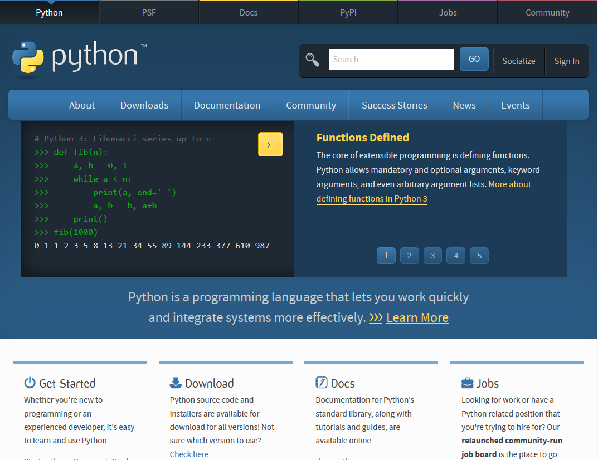

Sur le bandeau principal, vous pouvez apercevoir les libellés allant de "About"
à "Events". Pour notre cas, c'est bien évidemment le libellé "Downloads" qui
nous intéresse, puisqu'il signifie "Télécharger" en Français. En survolant ce
libellé à l'aide de la souris, vous devriez voir apparaître un menu contextuel
sur le dessous, comme présenté sur la figure 1.2.

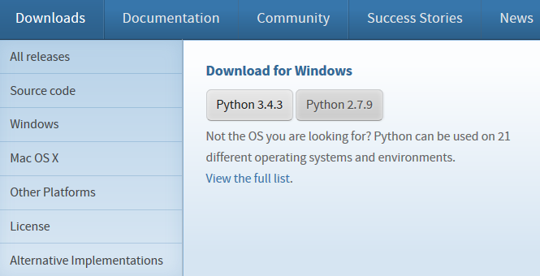

Vous pouvez voir que vous avez le choix entre deux versions de Python : la
**3.4.3** et la **2.7.9**. Puisqu'il s'agit d'un cours entièrement dédié à
Python 3, nous allons bien évidemment télécharger la version **3.4.3**.
Evidemment, à l'heure où ses lignes sont écrites, il se peut fortement que les
numéros de version mineurs aient changé. Heureusement pour nous, cela ne
changera pas grand-chose. Si vous avez un numéro de version supérieur à
**3.4.3**, cela ne posera aucun problème pour vous. Les changements qui auront
été effectués concerneront des corrections de bogues et autres joyeusetés.

Ainsi, après avoir cliqué sur le numéro de version à télécharger, le site web
vous propose de télécharger le fichier **python-3.4.3.msi**. Enregistrez-le sur
votre ordinateur, et exécutez-le. Vous devriez voir apparaître l'assistant
d'installation comme montré sur la figure 1.3.

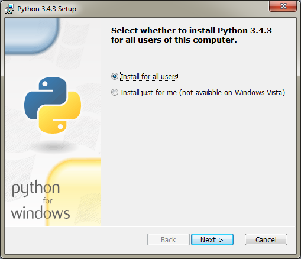

L'assistant vous demande si vous souhaitez installer Python pour tous les
utilisateurs de votre ordinateur, ou juste pour vous. Le choix vous revient et
importe peu ici. Sélectionnez l'option de votre choix et cliquez sur `Next >`.
Vous obtenez normalement la figure 1.4.

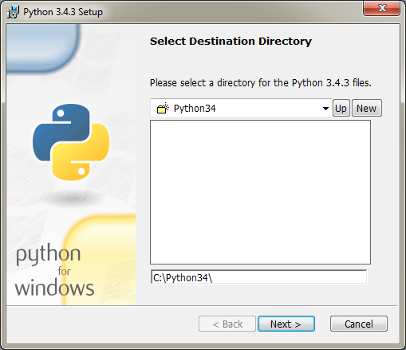

L'assistant vous demande ensuite le chemin d'installation de Python. Par
défaut, il s'agit de `C:\Python34\`. Nous vous recommandons de laisser ce
chemin par défaut pour plusieurs raisons. D'une part parce que cela évite les
désagréments, d'autre part parce que cela permet au binaire python de se
trouver proche de la racine du disque dur. Nous verrons en quoi cela est
pratique. Cliquez sur `Next >`. L'assistant vous affiche ainsi les options
sélectionnées pour l'installation de Python comme le montre la figure 1.5.

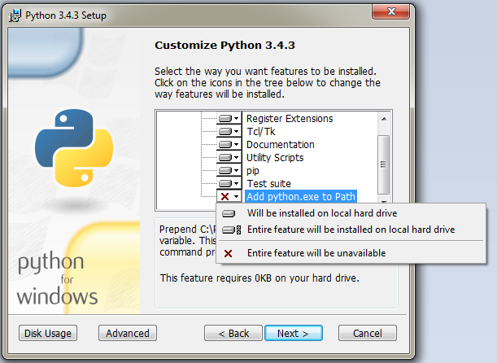

Vous pouvez voir que la seule option qui n'est pas sélectionnée concerne
l'ajout du binaire `python.exe` dans votre variable d'environnement "Path".
Lorsque vous exécutez un programme à l'aide de la console Windows, celle-ci va
vérifier si le programme ne se trouve pas dans un des chemins contenus dans
cette même variable. Si vous décidez d'ajouter python.exe à la variable
d'environnement "Path", vous pourrez taper "python" dans l'invite de commande
au lieu de devoir taper son chemin complet. C'est là que le fait d'installer
Python au plus proche de la racine de votre disque permettra de ne pas taper un
nom à rallonge.

Nous vous recommandons cependant d'activer l'option qui ajoute python.exe à la
variable d'environnement Path, et ce pour les raisons que nous venons de
décrire ci-dessus. Comme montré sur la capture ci-dessus, cliquez sur "Will be
installed on local hard drive" et vous devriez obtenir un résultat semblable à
la figure 1.6.

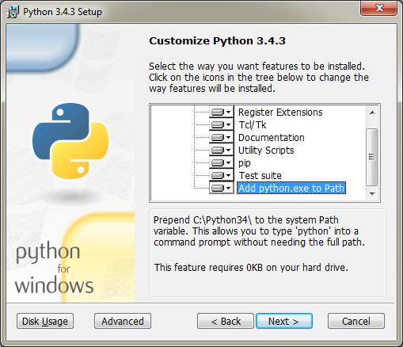

Cliquez sur `Next >`. L'installation peut enfin démarrer, et vous pouvez
obtenir des captures comme celles présentées sur les figures 1.7 et 1.8.

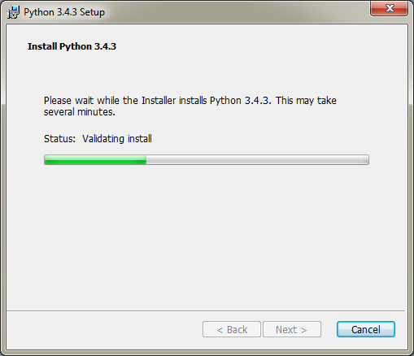

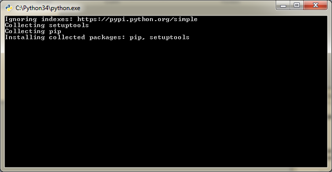

Si l'installation s'est correctement déroulée, l'assistant vous le fait savoir
comme le montre la figure 1.9.

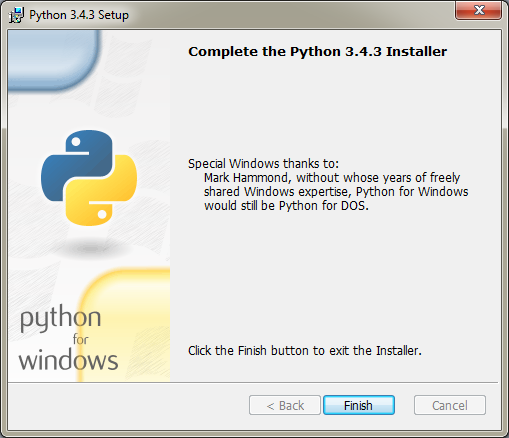

Félicitations, vous venez d'adopter un python sur votre système d'exploitation
Windows ! Il ne nous manque plus qu'à le lancer pour tester sa bonne
installation.

Ouvrez un invite de commande (Touche Windows+R pour obtenir la commande
"Exécuter", ou "Démarrer" puis "cmd" dans la barre de Recherche). Vous devriez
obtenir un invite de commande semblable à la figure 1.10.

Pour exécuter python, tapez simplement `python` si vous avez ajouté python.exe
à la variable d'environnement "Path". Sinon, tapez `\Python34\python` qui
correspond au chemin absolu de python.exe. Les figures 1.11 et 1.12 démontrent
que nous obtenons le même résultat suivant votre cas.

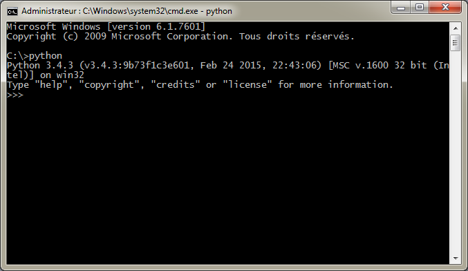

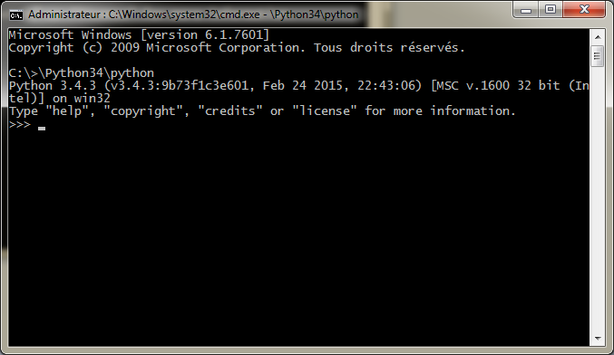

Pour quitter l'invite de commande python, matérialisé par les trois chevrons
`>>>` (nous reviendrons plus tard sur la signification de tout cela), faites la
combinaison de touches "Ctrl+Z" ; cela devrait afficher la séquence de
caractères "^Z" à l'écran. Tapez `Entrée` : vous avez quitté le programme
python sans encombre, comme le montre la figure 1.13.

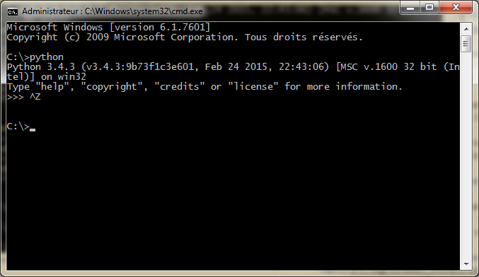
